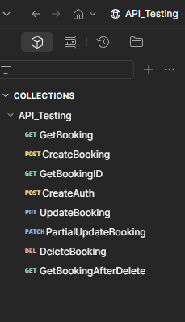
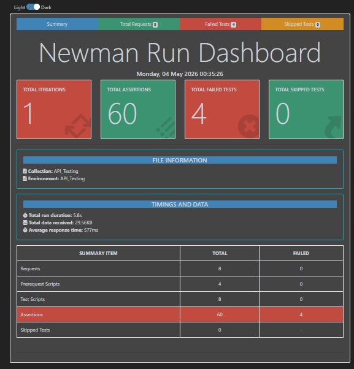

# 🧪 API Testing Project — Restful Booker

An end-to-end API testing project using **Postman** and **Newman** on the [Restful Booker](https://restful-booker.herokuapp.com) web application. This project covers full CRUD operations with automated test scripts and environment variables.

---

## 🔗 Base URL

```
https://restful-booker.herokuapp.com
```

---

## 🛠️ Tools & Technologies

| Postman 
| Newman 
| Javascript

---

## 📁 Project Structure

```
API-Testing-project/
│
├── images/
│   ├── collection.png        # Postman collection screenshot
│   └── report.png            # Newman report screenshot
│
├── API_Testing.postman_collection.json    # Postman collection file
├── API_Testing.postman_environment.json  # Environment variables file
├── newman_report.html                    # Newman HTML test report
└── README.md
```

---

## 📋 Collection Overview

The collection **API_Testing** contains the following requests:

| Method | Request Name | Description |
|--------|-------------|-------------|
| `GET` | GetBooking | Retrieve all bookings |
| `POST` | CreateBooking | Create a new booking |
| `GET` | GetBookingID | Get booking by specific ID |
| `POST` | CreateAuth | Generate auth token |
| `PUT` | UpdateBooking | Fully update a booking |
| `PATCH` | PartialUpdateBooking | Partially update a booking |
| `DELETE` | DeleteBooking | Delete a booking |
| `GET` | GetBookingAfterDelete | Verify booking is deleted |

---

## 🌍 Environment Variables

| Variable | Description |
|----------|------------|
| `base_url` | Base URL of the API |
| `ID` | Booking ID (dynamic) |
| `Token` | Auth token for secured requests (dynamic) |
| `FM` | First name (dynamic) |
| `LM` | Last name (dynamic) |
| `TP` | Total price (dynamic)|
| `DP` | Deposit paid (dynamic) |
| `AN` | Additional needs (dynamic) |
| `CIN` | Check-in date |
| `COUT` | Check-out date |

---

## 📸 Screenshots

### Postman Collection


### Newman Run Report


---

## 📊 Newman Test Report Summary

| Metric | Value |
|--------|-------|
| Total Iterations | 1 |
| Total Requests | 8 |
| Total Assertions | 60 |
| Failed Tests | 4 |
| Skipped Tests | 0 |
| Total Run Duration | 5.8s |
| Average Response Time | 577ms |

---

## 🧠 Challenges Faced

- Assertion mismatches during full collection run
- Data mismatch occurs when running full collection with Newman
- Individual requests work correctly

## ▶️ How to Run

### 1. Clone the Repository

```bash
git clone https://github.com/thamina21islam/API-Testing-project.git
cd API-Testing-project
```

### 2. Install Newman

```bash
npm install -g newman
npm install -g newman-reporter-htmlextra
```

### 3. Run the Collection

```bash
newman run API_Testing.postman_collection.json \
  -e API_Testing.postman_environment.json \
  -r htmlextra \
  --reporter-htmlextra-export newman_report.html
```

### 4. View Report

Open `newman_report.html` in your browser to see the full test report.

---

## 👤 Author

**Thamina Islam**
SQA Learner 

📌 Note

This project is created for learning and portfolio purposes.
